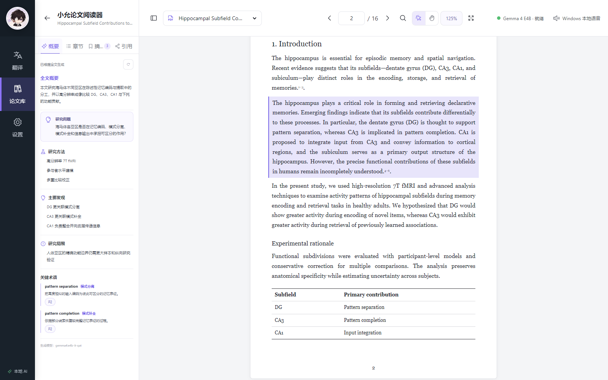
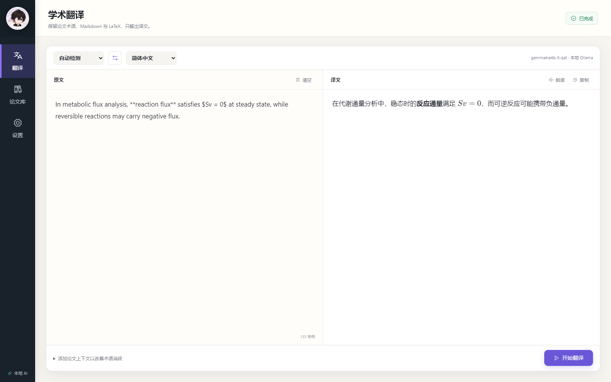
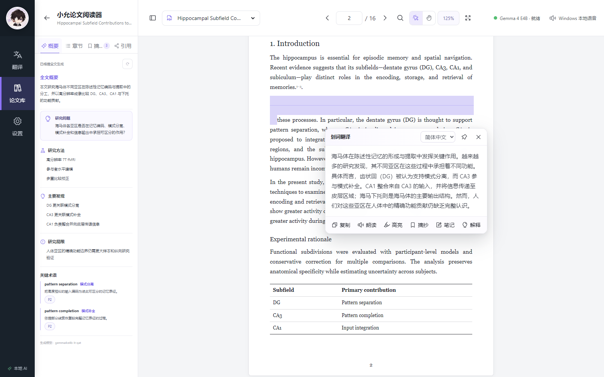
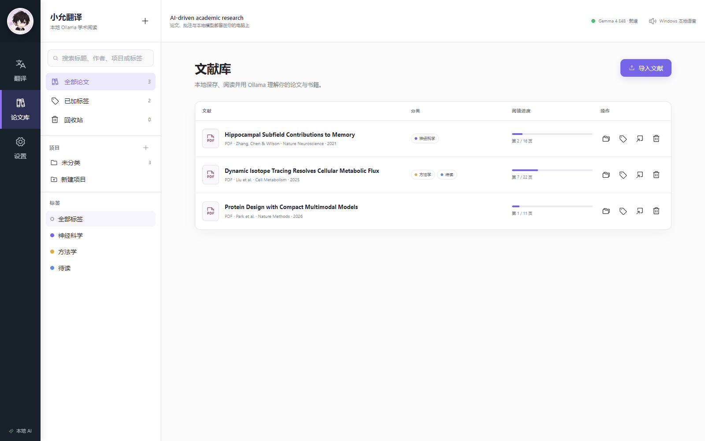
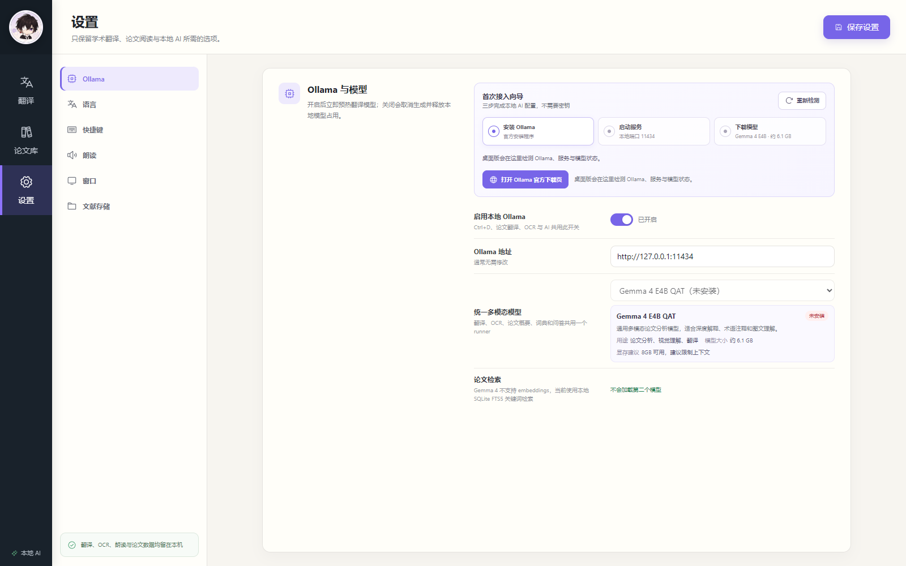

<div align="center">
  
  <h1>小允翻译</h1>
  <p><strong>把划词翻译、公式 OCR 与本地 AI 文献阅读放进同一个桌面工作台。</strong></p>
  <p>
    <a href="https://github.com/Xiaoyun-0922/xiaoyun-translator/releases/latest">下载 Windows 版</a>
    · <a href="./docs/GETTING_STARTED.md">快速上手</a>
    · <a href="./docs/OLLAMA.md">Ollama 接入</a>
    · <a href="./docs/ACADEMIC_WORKFLOW.md">学术阅读指南</a>
  </p>
  <p>
    
    
    
  </p>
</div>



> 截图中的论文、作者、数据与译文均为专门制作的合成演示内容，不代表真实研究结论。

## 为什么是小允翻译

小允翻译面向需要长期阅读论文、教材和技术文档的用户。它不把“翻译”做成孤立的文本框，而是让术语、上下文、公式、批注和阅读进度留在同一条研究工作流里。

-   **Ctrl+D 全局划词翻译**：在浏览器、Word、PDF 阅读器等应用中选中文字即可呼出轻量窗口；支持跟随鼠标、固定、复制和本地朗读。
-   **Ctrl+E 截图翻译 / 公式 OCR**：框选图片、扫描页或公式，由 Gemma 4 多模态模型识别并翻译。
-   **学术语境翻译**：可使用论文标题、选区前后文和已生成术语辅助消歧，减少 `flux` 等领域词被误译。
-   **Markdown 与 LaTeX**：译文保留粗体、列表、行内/块级公式、变量、单位、引文和数字，并直接渲染。
-   **AI 论文与书籍阅读器**：导入 PDF、Markdown、DOCX 或 TeX；论文生成全文概要，书籍建立目录并按章节生成摘要与关键术语。
-   **研究资料管理**：项目分类、标签、彩色高亮、摘录、笔记、页码回链、引用关系和阅读进度恢复。
-   **本地优先**：翻译、OCR、论文分析和 Windows 朗读均在本机完成，不需要云端 API Key。

## 看得见的研究工作流

### 学术翻译：Markdown、LaTeX 与术语一起保留



### 论文内划词即译，不离开当前页面



### 用项目、标签与阅读进度组织文献



### 三步接入本地 Ollama



## 快速开始

> [!IMPORTANT]
> 当前发布版仅在 **Windows 10/11 x64** 上验证。安装包目前**未进行代码签名**，Windows SmartScreen 可能显示“未知发布者”。

1. 从 [Releases](https://github.com/Xiaoyun-0922/xiaoyun-translator/releases/latest) 下载最新的 `xiaoyun-translator_*_x64-setup.exe`。
2. 运行安装程序。若 SmartScreen 拦截，请先核对下载来源和 Release 中的 SHA-256，再选择“更多信息 → 仍要运行”。
3. 打开“设置 → Ollama”，按首次接入向导：
    - 打开 Ollama 官方下载页并完成安装；
    - 启动本地服务；
    - 确认下载 `gemma4:e4b-it-qat`（约 **6.1 GB**）。
4. 模型显示“已就绪”后：
    - 选中文字并按 `Ctrl+D`；
    - 按 `Ctrl+E` 后框选截图；
    - 或进入“论文库”导入文献。

完整说明见[快速上手](./docs/GETTING_STARTED.md)和[Ollama 接入指南](./docs/OLLAMA.md)。

## 运行要求

| 项目     | 最低可运行                       | 推荐体验                    |
| -------- | -------------------------------- | --------------------------- |
| 操作系统 | Windows 10/11 x64                | Windows 11 x64              |
| 内存     | 16 GB                            | 24 GB 或以上                |
| 显卡     | 可使用 CPU，但未作为流畅体验验证 | NVIDIA GPU，8 GB 显存或以上 |
| 磁盘     | 安装包之外至少预留 8 GB          | 预留 12 GB 或以上           |
| 本地模型 | `gemma4:e4b-it-qat`，约 6.1 GB   | 同左，保持单模型运行        |

8 GB 显存可以运行当前 QAT 模型，但长上下文、扫描页 OCR 与大型 PDF 会更紧张。软件采用单一 Gemma 4 runner，避免同时预热多个模型浪费显存。

## 文献能力

| 能力     | 论文                                       | 书籍                                   |
| -------- | ------------------------------------------ | -------------------------------------- |
| 导入格式 | PDF、Markdown、DOCX、TeX                   | PDF、Markdown、DOCX、TeX               |
| 结构整理 | 全文概要、研究问题、方法、发现、局限、术语 | 独立目录、章节跳转、章节摘要、章节术语 |
| 扫描件   | 当前页 OCR、可暂停的整篇 OCR               | 同左，适合长扫描书分批处理             |
| 阅读辅助 | 划词翻译、词典、解释、摘录、笔记、高亮     | 同左                                   |
| 持久化   | 阅读进度、标注、概要和索引保存在本机       | 阅读进度、目录和章节结果保存在本机     |

PDF 阅读由 PDF.js 提供。超长文档按页虚拟化，文本索引在后台分批建立；扫描 PDF 需要 OCR，因此首次处理会比含文本层的 PDF 慢。

## 隐私与数据

-   Ollama 默认连接 `http://127.0.0.1:11434`。
-   文献原文件、索引、概要、翻译缓存、项目、标签、笔记和标注均保存在本机。
-   Windows 朗读使用系统本地语音，不调用 Lingva 等网络 TTS。
-   设置远程 Ollama 地址时，发送到该地址的内容将受远程设备和网络环境影响；请自行确认数据边界。
-   软件不会静默下载模型。6.1 GB 模型下载前会再次确认，并显示进度，可中途取消。

## 常见问题

**Ctrl+D / Ctrl+E 没有反应**

确认软件仍在系统托盘运行；在“设置 → 快捷键”检查组合键是否与浏览器或其他软件冲突。修改快捷键后点击“保存设置”。

**Ollama 无法连接**

在 PowerShell 执行：

```powershell
ollama list
curl.exe http://127.0.0.1:11434/api/tags
```

若命令失败，请先启动 Ollama，再回到软件点击“重新检测”。更多情况见[故障排查](./docs/OLLAMA.md#故障排查)。

**PDF 显示空白**

先确认文件能在 Edge 中打开。扫描 PDF 请选择“当前页 OCR”或后台整篇 OCR；JBIG2 扫描书已由内置 PDF.js WASM 解码支持。

**安装时提示未知发布者**

当前安装包未签名，这是已知发布限制。只从本仓库 Releases 下载，并核对 Release 提供的校验值。

## 开发

```powershell
git clone https://github.com/Xiaoyun-0922/xiaoyun-translator.git
cd xiaoyun-translator
pnpm install
pnpm test
pnpm tauri dev
```

构建 Windows 安装包：

```powershell
pnpm build
cargo test --manifest-path src-tauri/Cargo.toml --all-targets
pnpm tauri build
```

主要技术栈：Tauri 2、Rust、React 18、PDF.js、SQLite FTS5、Ollama、KaTeX。

## 项目来源、兼容性与许可证

本项目基于 [Pot Desktop 3.0.7](https://github.com/pot-app/pot-desktop) 进行深度改造，保留并感谢 Pot 及其贡献者的工作。小允翻译继续依据 [GNU GPL v3](./LICENSE) 发布；分发修改版本时请遵守 GPL 对源代码与许可证的要求。

为保留已有 Pot 数据，当前版本暂时沿用 bundle identifier `com.pot-app.desktop`。这意味着：

-   **不建议与原版 Pot 并行安装或同时运行**；
-   两者可能共享配置/数据位置、托盘状态或快捷键；
-   安装小允翻译前建议备份重要配置和文献库。

Ollama 与 Gemma 模型各自适用其上游许可证和使用条款，本仓库不重新分发模型文件。

## 参与贡献

欢迎提交 Issue、复现步骤、脱敏样例文档和 Pull Request。报告问题时请附：

1. Windows 版本；
2. 软件版本与 Ollama 版本；
3. `ollama list` 中的模型名；
4. 可复现步骤和不含隐私信息的截图；
5. 问题属于 Ctrl+D、Ctrl+E、论文阅读还是模型输出。
